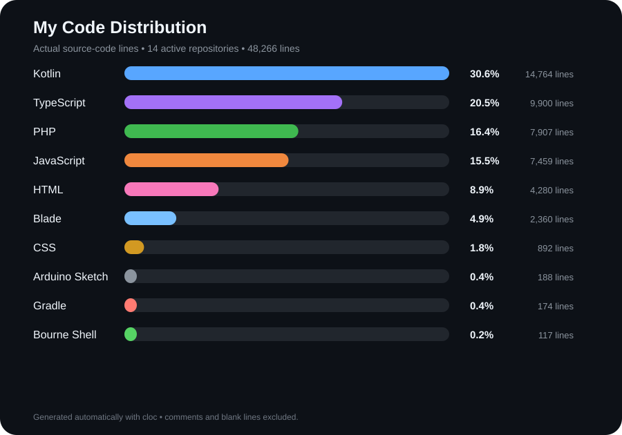

<!-- ========================================================= -->
<!--                  MOHAMED020EGY01 PROFILE                   -->
<!-- ========================================================= -->

<p align="center">
  
</p>

<p align="center">
  <a href="https://github.com/MOHAMED020EGY01">
    
  </a>
</p>

<p align="center">
  <a href="https://github.com/MOHAMED020EGY01?tab=repositories">
    
  </a>
  
</p>

---

## 👨‍💻 About

I'm **Mohamed Mohamed**, a software developer working across web applications, Android development, AI/computer vision, and connected hardware.

I enjoy taking a problem from **idea → architecture → implementation → working system**.

- **Backend:** Laravel, PHP, REST APIs, MySQL
- **Frontend:** React, Next.js, TypeScript
- **Android:** Kotlin, Jetpack Compose
- **AI:** Python, PyTorch, Computer Vision, Object Detection
- **IoT:** ESP32, ESP32-CAM, sensors and hardware control
- **3D:** Unity, C#, Blender

---

## ⚡ What I Build

<table>
  <tr>
    <td width="50%" valign="top">

### 🌐 Full-Stack
Laravel APIs, authentication, databases, real-time systems, React interfaces and business applications.

    </td>
    <td width="50%" valign="top">

### 📱 Android
Kotlin and Jetpack Compose applications with local data, background work, widgets and polished UI.

    </td>
  </tr>
  <tr>
    <td width="50%" valign="top">

### 🧠 AI & Computer Vision
Object detection, image processing, inference pipelines and AI systems connected to real-world inputs.

    </td>
    <td width="50%" valign="top">

### 🔌 IoT
ESP32 projects, sensors, device control and software that connects physical hardware with web and AI systems.

    </td>
  </tr>
</table>

---

## 🧰 Tech Stack

<p align="center">
  
</p>

<p align="center">
  
</p>

<p align="center">
  
</p>

<p align="center">
  
</p>

---

## 🚀 Selected Work

### 📱 HabitFlow
**Kotlin • Jetpack Compose • Room • WorkManager • Glance**

A local-first Android habit tracking application with rich UI, custom scheduling, interactive home-screen widgets, background reliability, calendar history, and Arabic/English support.

**Repository:** [MOHAMED020EGY01/HabitFlow](https://github.com/MOHAMED020EGY01/HabitFlow)

---

### 🏢 Project Management System
**Laravel • PHP • MySQL • Redis • Fortify • Sanctum • Pusher/Socket**

A team-oriented platform for projects, tasks, users, collaboration, real-time chat, notifications, company organization and role-based access.

**Repository:** [MOHAMED020EGY01/theProjectMangement](https://github.com/MOHAMED020EGY01/theProjectMangement)

---

### 🔧 Smart Service
**Laravel • PHP • REST API**

A Laravel-based service platform focused on API-driven application architecture.

**Repository:** [MOHAMED020EGY01/smart_service](https://github.com/MOHAMED020EGY01/smart_service)

---

### ♻️ Smart Basket
**AI • Computer Vision • ESP32-CAM • FastAPI • YOLO • IoT**

A smart waste-sorting system combining computer vision and embedded hardware for real-world object classification and sorting.

**Status:** Private project

---

## 🐍 Contribution Snake

<p align="center">
  
</p>

> The animation is based on the GitHub contribution grid and is refreshed from repository data.

---

## 📊 GitHub Activity

<p align="center">
  
  
</p>

<p align="center">
  
</p>

<!-- PROFILE_STATS_START -->
### Live Profile Stats

| Metric | Value |
|---|---:|
| Active owned repositories scanned | 14 |
| Private repository scan | Disabled — add PROFILE_STATS_TOKEN to include private repositories |
| Contributions in the last year | See GitHub activity |
| Source-code lines analyzed | 48,266 |
| Languages detected | 15 |

<p align="center">
  
</p>

| Language | Code lines | Share |
|---|---:|---:|
| Kotlin | 14,764 | 30.6% |
| TypeScript | 9,900 | 20.5% |
| PHP | 7,907 | 16.4% |
| JavaScript | 7,459 | 15.5% |
| HTML | 4,280 | 8.9% |
| Blade | 2,360 | 4.9% |
| CSS | 892 | 1.8% |
| Arduino Sketch | 188 | 0.4% |
| Gradle | 174 | 0.4% |
| Bourne Shell | 117 | 0.2% |
| SCSS | 98 | 0.2% |
| DOS Batch | 71 | 0.1% |
<!-- PROFILE_STATS_END -->

---

## 🧭 Current Direction

<p align="center">
  
</p>

---

## 🧩 Engineering Mindset

```text
Problem
   ↓
Understand
   ↓
Design
   ↓
Build
   ↓
Test
   ↓
Measure
   ↓
Improve
```

> Build the simplest system that solves the real problem.
> Then improve it where the evidence says it matters.

---

## 🌐 Find Me

<p align="center">
  <a href="https://github.com/MOHAMED020EGY01">
    
  </a>
</p>

<p align="center">
  <sub>Web • Kotlin • AI • IoT • 3D</sub>
</p>

<p align="center">
  
</p>

---