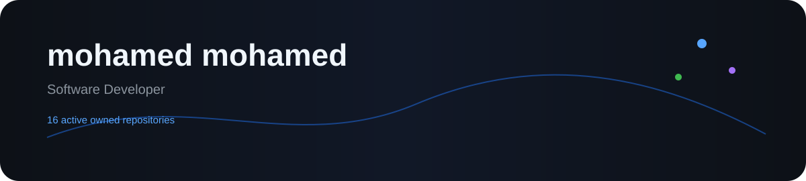

# mohamed mohamed

  

  

## About

Software Developer building across web, mobile, AI and IoT.

---

## Profile Snapshot

| Metric | Value |
|---|---:|
| Active owned repositories | 16 |
| Contributions in the last year | 223 |
| Source-code lines analyzed | 48,630 |
| Languages detected | 17 |

---

## My Code Distribution

  

| Language | Code lines | Share |
|---|---:|---:|
| Kotlin | 14,764 | 30.4% |
| TypeScript | 9,900 | 20.4% |
| PHP | 7,907 | 16.3% |
| JavaScript | 7,459 | 15.3% |
| HTML | 4,392 | 9.0% |
| Blade | 2,360 | 4.9% |
| CSS | 892 | 1.8% |
| C/C++ Header | 221 | 0.5% |
| Arduino Sketch | 202 | 0.4% |
| Gradle | 174 | 0.4% |
| Bourne Shell | 117 | 0.2% |
| SCSS | 98 | 0.2% |

---

## Recent Projects

### [smart_service](https://github.com/MOHAMED020EGY01/smart_service)
**PHP • Public • ★ 0**  
No repository description provided.  
Last updated: 2026-09-14

---

### [HabitFlow](https://github.com/MOHAMED020EGY01/HabitFlow)
**Kotlin • Public • ★ 1**  
No repository description provided.  
Last updated: 2026-07-23

---

### [Exam](https://github.com/MOHAMED020EGY01/Exam)
**TypeScript • Public • ★ 0**  
No repository description provided.  
Last updated: 2026-06-27

---

### [theFirstProjectReactNative](https://github.com/MOHAMED020EGY01/theFirstProjectReactNative)
**TypeScript • Public • ★ 0**  
No repository description provided.  
Last updated: 2026-05-20

---

### [Home](https://github.com/MOHAMED020EGY01/Home)
**Code • Public • ★ 0**  
No repository description provided.  
Last updated: 2026-04-30

---

### [Blander_level_1](https://github.com/MOHAMED020EGY01/Blander_level_1)
**Code • Public • ★ 0**  
No repository description provided.  
Last updated: 2026-04-23

---

### [ESP32ControllerEngine](https://github.com/MOHAMED020EGY01/ESP32ControllerEngine)
**C • Public • ★ 0**  
No repository description provided.  
Last updated: 2026-03-04

---

### [ESP32-LED-Controller-in-WEB](https://github.com/MOHAMED020EGY01/ESP32-LED-Controller-in-WEB)
**C++ • Public • ★ 0**  
No repository description provided.  
Last updated: 2026-02-22

---

## Engineering Focus

  <b>Full-Stack • Kotlin • AI • Computer Vision • IoT • 3D</b>

---

## GitHub

  <a href="https://github.com/MOHAMED020EGY01">github.com/MOHAMED020EGY01</a>

  This profile is regenerated automatically from GitHub data and source-code analysis.

  

